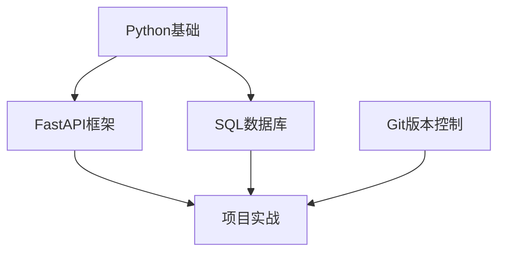

# TA Agent 改造 — MVP 亮点路线图

> **基调：** 这是一个"概念贩卖"项目，不是生产交付。最终只需要一份设计文档 + 每人一个亮点切片。
> **选择权在你：** 下面每人给了"推荐亮点"和"最低保证"，量力而行，不勉强。
> **唯一纪律：** 不改 `agent_loop.py`。

---

## 核心思路

不再强求四人耦合。每个人独立选一个**最出彩的点**做 MVP 展示，
代码能跑最好，跑不了就写文档 + 伪代码。

```
┌─────────────────────────────────────────────────────┐
│                   最终交付                            │
│  ├── 设计文档（必须）                                 │
│  ├── 每人亮点切片（代码 / 截图 / 伪代码片段）          │
│  └── B 的学习路线拓扑 skill（可独立交付）              │
└─────────────────────────────────────────────────────┘
```

---

## 四人亮点建议（自由选择，不强制）

### A. 钟俊 — `--persona ta` 一键换皮

**推荐亮点：** 跑 `pico --persona ta` 和 `pico --persona coder`，
截图对比两条 prompt prefix 的差异，证明"换皮"这个核心理念成立。

| 层级 | 内容 | 工作量 |
|------|------|--------|
| 🏆 **亮点** | `build_persona_prefix("ta")` 返回完整 TA 前缀 + `cli.py` 的 `--persona` 参数连通 + 截图对比 | 2 小时 |
| ✅ **最低保证** | 文档中写清楚 TA 前缀应该长什么样、注入点在哪、resume 时如何检测 persona drift | 30 分钟 |

**为什么出彩：** 这是整个改造方案的第一性原理证明——pico 是 harness，
换人设不需要改主循环。

---

### B. 徐国洪（你） — 学习路线拓扑图 Skill ⭐

**推荐亮点（这是团队最出彩的点）：**
把"基于知识依赖关系生成学习路线"做成一个可独立交付的 skill，
包含拓扑排序算法 + 可视化 + 学习计划生成。

**做什么：**
- 输入：JSON/YAML 描述的知识点依赖关系（如"Python基础 → FastAPI → 项目实战"）
- 处理：Kahn 算法做拓扑排序，检测循环依赖
- 输出：Mermaid.js 流程图 + 分阶段学习计划表

**目录结构：**
```
pico/skills/learning_route/
  __init__.py          # skill 入口
  topo.py              # 拓扑排序引擎（Kahn 算法）
  planner.py           # 学习计划生成器
  renderer.py          # Mermaid.js 渲染
  example_data.json    # 示例：FastAPI 全栈学习路线
```

| 层级 | 内容 | 工作量 |
|------|------|--------|
| 🏆 **亮点** | 完整 skill：topo → planner → mermaid 渲染，`python -m pico.skills.learning_route` 直接出图 | 4 小时 |
| ✅ **中等** | 仅 topo.py + planner.py，用 print 输出文本路线，不出图 | 2 小时 |
| ✅ **最低保证** | 文档 + 伪代码 + 一个手绘拓扑图照片 | 30 分钟 |

**为什么出彩：**
1. **可视化** — 答辩时放一张拓扑图比放代码有冲击力得多
2. **教育属性** — 切合"助教"场景，展示 TA 能帮实习生规划学习路径
3. **可沉淀为 Skill** — 独立于 pico 主项目，可直接发布为 opencode skill
4. **算法趣味** — Kahn 拓扑排序是经典算法，答辩能讲出技术深度

---

### C. 兰凯崴 — Risk 五元组校验

**推荐亮点：** 写一个 `Risk` dataclass + `validate()` 方法 + 一个 pytest，
展示"输出约束是 schema 校验不是 prompt 恳求"这个理念。

| 层级 | 内容 | 工作量 |
|------|------|--------|
| 🏆 **亮点** | `Risk` 类 + `validate_final_answer()` + 一个测试用例（构造缺 evidence 的 risk 看如何被拦下） | 2 小时 |
| ✅ **最低保证** | 文档中定义好五元组 schema + 说明为什么放 post-hook 而不是 agent_loop 里 | 30 分钟 |

**为什么出彩：** 这是整个方案里"最小侵入 harness 思维"的最佳证据——
五元组校验是事后判定，不影响主循环纯度。

---

### D. 杜宇 — 一个指标跑通

**推荐亮点：** 只实现 `compute_goal_clarity()` 一个指标，拿一份 fake report 跑出数值，
展示"可量化"这件事本身成立即可。

| 层级 | 内容 | 工作量 |
|------|------|--------|
| 🏆 **亮点** | `compute_goal_clarity(report) -> 0.8` + 一个 pytest + 输出一行指标表 | 1.5 小时 |
| ✅ **最低保证** | 文档中定义 5 个指标的公式 + 说明指标 5 的人工 oracle 如何标注 | 30 分钟 |

**为什么出彩：** "量化"是老师明确提的需求，一个可运行的指标比五个文档里的指标更有说服力。

---

## 一周建议节奏（不加班版）

| 时间段 | 做什么 |
|--------|--------|
| **Day 1 晚（1h）** | 群里吼一声各自选亮点，互不影响，不需要接口对齐 |
| **Day 2-4 摸鱼做** | 各自写自己的 MVP 代码/文档，有疑问群里问 |
| **Day 4 晚** | 各自把产物推到分支，README 里写一段自己的亮点说明 |
| **Day 5** | 合一个总文档，每人 1-2 页切片，B 的 skill 单独一章节 |

> 如果谁完全不想动：写两段设计说明也算交差。这项目本质是贩卖概念。

---

## 最终交付物（减负版）

```
交付报告.md              ← 每人 1-2 页亮点切片（必须）
pico/ta/persona.py       ← A 的亮点代码（可选）
pico/skills/learning_route/  ← B 的 skill 包（可选）
pico/ta/harness.py       ← C 的亮点代码（可选）
pico/ta/metrics.py       ← D 的亮点代码（可选）
```

---

## B 的 Skill：学习路线拓扑图（详细设计）

这是我觉得团队最能出彩的点，单独展开写一下。

### 输入格式示例

```json
{
  "topics": [
    {"id": "python", "name": "Python基础", "depends_on": []},
    {"id": "git", "name": "Git版本控制", "depends_on": []},
    {"id": "fastapi", "name": "FastAPI框架", "depends_on": ["python"]},
    {"id": "sql", "name": "SQL数据库", "depends_on": ["python"]},
    {"id": "project", "name": "项目实战", "depends_on": ["fastapi", "sql", "git"]}
  ],
  "estimated_hours": {
    "python": 40, "git": 8, "fastapi": 24, "sql": 16, "project": 40
  }
}
```

### 输出示例

```
=== 学习路线（拓扑排序结果）===

阶段 1（并行学习）: Python基础, Git版本控制
阶段 2（并行学习）: FastAPI框架, SQL数据库
阶段 3: 项目实战

=== 学习计划 ===
第1周: Python基础 (40h)
第1周: Git版本控制 (8h)  
第2周: FastAPI框架 (24h)
第2周: SQL数据库 (16h)
第3-4周: 项目实战 (40h)
总时长: ~4周 (128h)

=== 拓扑图 (Mermaid.js) ===

```

### Skill 沉淀

这个 skill 可以独立发布为 opencode skill：

```json
{
  "name": "learning-route",
  "description": "基于拓扑排序生成学习路线图和计划",
  "tools": ["generate_learning_route"],
  "config": {
    "allowed_tools": ["list_files", "read_file", "generate_learning_route"]
  }
}
```

---

## 现有代码中的 TODO

之前在代码里插的 TODO 标记**不需要全部实现**。它们的作用是：

1. **设计痕迹** — 展示"如果真要实现，接口长这样"
2. **备选亮点** — 如果你想换方向，顺着 TODO 做就行
3. **最低保证的参考** — 文档里写设计时照着 TODO 的结构写

```
TODO[A]: 8 处 — 钟俊的 persona 注入点
TODO[B]: 12 处 — 原本的 TA 工具定义（已弃用，改为学习路线 skill）
TODO[C]: 9 处 — 兰凯崴的 harness 校验点
TODO[D]: 7 处 — 杜宇的指标计算点
```
