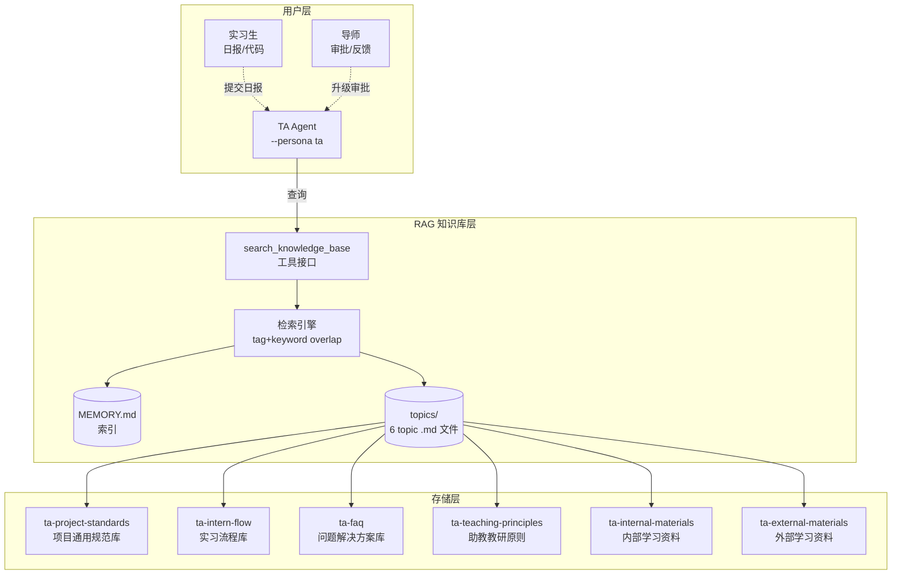
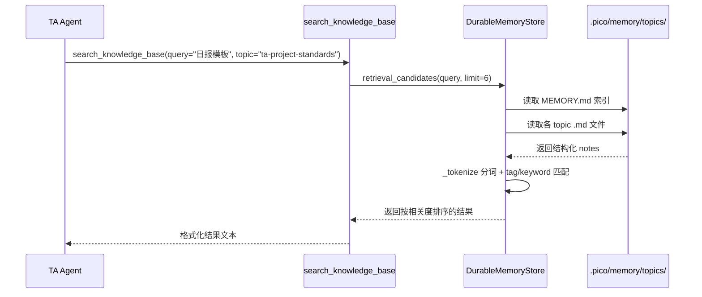
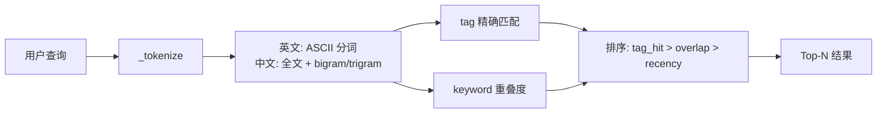
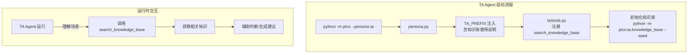

# TA Agent RAG 知识库架构

> 基于 `DurableMemoryStore` 的轻量级 RAG 实现，无外部向量数据库依赖。

---

## 一、架构总览



---

## 二、数据流



---

## 三、存储结构

```
.pico/memory/
├── MEMORY.md                 # 索引文件（自动维护）
│   - [ta-project-standards](topics/ta-project-standards.md): 项目通用规范库
│   - [ta-intern-flow](topics/ta-intern-flow.md): 实习流程库
│   - [ta-faq](topics/ta-faq.md): 问题解决方案库
│   - [ta-teaching-principles](topics/ta-teaching-principles.md): 助教教研原则
│   - [ta-internal-materials](topics/ta-internal-materials.md): 内部学习资料
│   - [ta-external-materials](topics/ta-external-materials.md): 外部学习资料
│
└── topics/
    ├── ta-project-standards.md         # 7 条知识
    ├── ta-intern-flow.md              # 7 条知识
    ├── ta-faq.md                      # 9 条知识
    ├── ta-teaching-principles.md       # 7 条知识
    ├── ta-internal-materials.md        # 6 条知识
    └── ta-external-materials.md        # 8 条知识
```

### Topic 文件格式

```markdown
# 项目通用规范库
- topic: ta-project-standards
- summary: 各类小项目（数据分析/工具开发/报告）交付标准与模板。
- tags: ta, standard, project-template
- updated_at: 2026-07-16T00:34:04

## Notes
- 数据分析类项目交付标准：需包含 (1) 数据来源与 ETL 过程描述 (2) ...
- 工具开发类项目交付标准：需包含 (1) 项目 README（安装/使用/示例）(2) ...
- 报告类项目交付标准：需包含 (1) 背景与问题定义 (2) 方法与数据描述 ...
- 周报模板：markdown 格式，包含本周完成（附证据链接）...
- ...
```

---

## 四、检索算法



### 检索公式

```
score = (exact_tag_match, keyword_overlap, recency)
```

- `exact_tag_match`: 查询 token 是否命中 note 的 tags（布尔值，最高优先级）
- `keyword_overlap`: 查询 token 与 note 文本的 token 交集数
- `recency`: 笔记创建时间戳（ISO 时间，同分时更新者优先）

---

## 五、与 TA Agent 的集成



---

## 六、6 大知识域总览

| Topic | 标题 | 条目 | 标签 | 用途 |
|---|---|---|---|---|
| `ta-project-standards` | 项目通用规范库 | 7 | ta, standard, project-template | 交付标准、模板、评审清单 |
| `ta-intern-flow` | 实习流程库 | 7 | ta, flow, intern-sop | 日报/周报流程、导师介入规则 |
| `ta-faq` | 问题解决方案库 | 9 | ta, faq, case-study | 踩坑案例、答疑话术 |
| `ta-teaching-principles` | 助教教研原则 | 7 | ta, principle, ethics | 禁止替代执行、SBI反馈模型 |
| `ta-internal-materials` | 内部学习资料 | 6 | ta, material, internal-training | 项目架构、工具文档、部署流程 |
| `ta-external-materials` | 外部学习资料 | 8 | ta, material, external-resource | Python/Git/SQL/ML/LLM 教程 |

---

## 七、设计决策记录

| 决策 | 选择 | 原因 |
|---|---|---|
| 检索方式 | tag + keyword overlap | 不上 embedding，省向量库工程，小规模够用 |
| 存储格式 | markdown 文件 | 人类可读、git 可追踪、零依赖 |
| 中文分词 | 全文 + bigram/trigram | 避免 jieba 依赖，覆盖大多数查询场景 |
| 初始化方式 | `seed_knowledge_base()` CLI | 一次命令填充，后续增量更新 |
| 与 Agent 集成 | 工具调用 `search_knowledge_base` | TA 在运行时按需查询，不占用 system prompt |

---

## 八、量化指标

| 指标 | 数值 |
|---|---|
| 总知识条目数 | 44 |
| 覆盖 topic 数 | 6 |
| 单条平均长度 | ~120 字 |
| 检索响应时间 | < 10ms（本地文件） |
| 代码行数 | ~300 行 |
| 测试覆盖率 | 8 个测试用例全部通过 |
