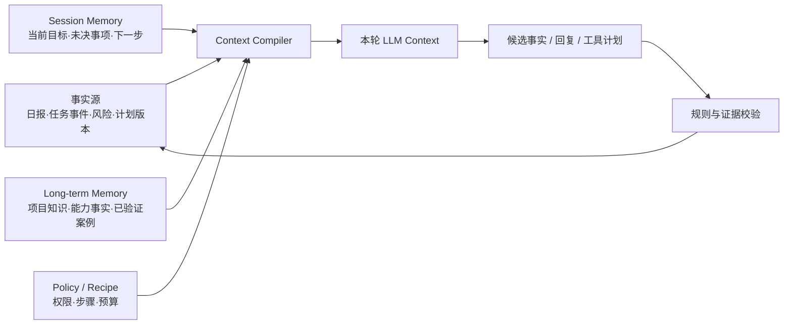

# 助教 Agent：Context 模块设计

> 适用场景：Agent 每天与实习生交互，收集日报、确认任务进展、规划次日工作，并根据真实项目状态调整阶段计划和中长期路线图。
>
> 本文只定义 Context 模块：信息如何选择、组装、压缩、恢复和接入长期记忆。任务执行、通知、审批和完整数据库设计不在本文展开。

---

## 1. 目标与边界

Context 模块的目标不是“让模型看到所有信息”，而是让模型在每个步骤看到：

- 当前动作必需的最小信息；
- 与导师确认目标一致的计划基线；
- 可回查的事实和证据；
- 仍有效且与当前任务相关的记忆；
- 明确的权限、时效和 token 边界。

助教 Agent 的业务闭环为：

```text
收集日报 -> 确认事实 -> 对齐当前计划 -> 识别偏差
-> 规划次日行动 -> 必要时提出阶段/路线图调整
```

“沿正确路径推进”定义为：每日行动可追溯到导师确认的项目目标、当前阶段门、里程碑或风险消减动作；当证据表明原计划不可行时，Agent 提出带影响说明的调整建议，而不是自行改变项目目标。

### 1.1 模块边界

| Context 模块负责 | Context 模块不负责 |
|---|---|
| 按业务步骤检索和组装上下文 | 自由判断任务是否验收 |
| 管理 token 预算与分层压缩 | 代替任务、风险和计划主表 |
| 保持跨压缩、跨会话连续性 | 自行修改关键里程碑或项目范围 |
| 标注来源、信任级别和有效期 | 让 LLM 直接执行权限与升级规则 |
| 记录“为何加载/排除某条信息” | 保存无业务必要的敏感推断 |

### 1.2 核心原则

1. **存储不等于 Context**：数据可以长期保存，但只有完成当前步骤所需的切片进入 Prompt。
2. **摘要不等于事实**：摘要只用于连续性；状态变更、验收、升级和关键计划调整必须回查结构化事实或原始证据。
3. **LLM 提取，规则裁决**：模型提取候选事实；权限、状态机、升级阈值和审批边界由确定性代码执行。
4. **先便宜后昂贵**：先投影、去重、落盘和占位，超过阈值后才调用 LLM 压缩。
5. **可恢复压缩**：完整记录先落盘，再从活跃 Context 移除；任何关键内容都能通过稳定引用回查。
6. **作用域先于相关性**：先解析调用者和本轮实习生作用域，再校验权限与敏感级别，最后做相关性检索。

---

## 2. Context 模型

### 2.1 四类信息



| 类型 | 作用 | 是否可被摘要替代 |
|---|---|---|
| 事实源 | 原始日报、已确认事件、任务/风险状态、计划 baseline | 否 |
| Session Memory | 当前会话做到哪里，支持跨压缩续接 | 可以重建，但压缩前必须持久化 |
| Long-term Memory | 跨会话仍有用的项目知识、反馈、能力事实和案例 | 否；需有来源、状态和 TTL |
| Compiled Context | 本轮实际发给模型的临时上下文 | 是；每轮按 Recipe 重建 |

### 2.2 Context 分层与顺序

Context 按“稳定前缀 → 半稳定前缀 → 动态后缀”组装：

1. **Stable Prefix**：角色、通用边界、安全规则及固定输出协议；LLM 每轮仅返回一个 `<tool>`（JSON 字段为 `name`、`args`）或 `<final>` 块。
2. **Route Prefix**：脱敏的辅导对象作用域指纹、当前角色、Recipe 允许的 Tool Schema、Skill Metadata，以及模型所需的项目/导师策略投影及其版本；同一路由内保持稳定。
3. **Cache Boundary**：显式缓存断点；若供应商使用隐式前缀缓存，则该位置仍作为内部逻辑边界。
4. **Runtime Envelope**：当前时间、时区、请求 ID，以及服务端解析出的 `actor_id/actor_role`、`tenant_id/assignment_id/project_id/intern_id/mentor_id`。
5. **Loaded Skill（可选）**：编译前按 metadata 校验并加载的 `SKILL.md`，作为受信流程约束进入 Context。
6. **Active State**：当前阶段、活动任务、风险、里程碑和生效计划版本。
7. **Relevant Memory**：相关的 Session Memory 与 Long-term Memory。
8. **User Intent**：由认证入口或服务端路由解析出的本轮操作意图。
9. **Submitted Content**：日报正文、粘贴文本和附件内容，始终使用不可信数据边界包裹。

工具完整 Schema 仅在 Recipe 允许时进入 Route Prefix。Router 在编译前根据业务步骤和 Skill Metadata 选择 Skill，Context Compiler 通过 `load_skill` 加载正文。权限优先于缓存命中率，不能为复用缓存而暴露未授权工具。

其中 `actor` 表示当前调用者，`intern` 表示本轮辅导对象。系统不假定实习生全局只对应一个项目或导师；可信身份/项目服务必须为本轮返回唯一有效的 `assignment_id + intern_id + project_id + mentor_id` 绑定。绑定缺失、存在歧义、不匹配或越权时，Context 编译应失败关闭，不能自行选择或回退。该绑定下的会话、任务切片、记忆和工件统一使用：

```text
scope_payload = canonical_json([tenant_id, assignment_id, intern_id, project_id, mentor_id])
subject_scope_key = "hmac-sha256:v1:" + base64url(HMAC-SHA256(scope_key_v1, scope_payload))
```

`canonical_json` 使用固定字段顺序和编码；`v1` 用于密钥轮换。该键只用于索引、审计和缓存命名空间，不能替代权限校验。默认只检索当前 `subject_scope_key`；仅经验证且由 Recipe 允许的通用案例可使用 `organization` 作用域。禁止以通配符或失败回退扩大范围。导师或项目绑定变化时生成新作用域，历史数据只能经显式授权迁移或回查。

### 2.3 Prompt Cache 组装策略

Prompt Cache 依赖前缀完全一致，因此必须遵守：

- 缓存边界前禁止出现时间戳、请求 ID、session 状态、检索记忆、随机数和工具结果。
- 所有列表按稳定键排序，JSON/YAML 使用确定性序列化，避免字段顺序或空白变化导致失配。
- Route Prefix 按 `subject_scope_key + model + actor_role + authorization_snapshot_hash + system_version + policy_snapshot_hash + recipe_version + tool_schema_hash + skill_metadata_hash` 生成 `cache_fingerprint`。
- System Prompt、Tool Schema、Recipe 或项目/导师策略变化时自然失效，不做模糊复用。
- Long-term Memory 和 Active State 放在缓存边界后；否则记忆新增或状态变化会频繁击穿缓存，且可能造成过时信息复用。
- 供应商支持多段缓存时，可复用全局 Stable Prefix，并按 `subject_scope_key` 缓存 Route Prefix；不支持时退化为单一最长稳定前缀。
- 只有达到供应商最低可缓存 token 门槛时才标记缓存，具体阈值通过模型适配器配置，不写死在业务代码中。
- 模型适配器负责把逻辑 Cache Boundary 映射为供应商支持的 `cache_control` 或隐式前缀缓存机制，业务层不依赖某一家 API 格式。

Context Manifest 记录 `cache_fingerprint`、缓存前缀 token 数、命中状态和失效原因。Prompt Cache 只优化成本与延迟，不改变服务端的身份、权限和工具参数校验。

---

## 3. Context Block 与信任模型

所有动态信息统一包装为 Context Block，禁止向 Prompt 裸塞数据库行或工具文本：

```json
{
  "block_id": "task:t1@v12",
  "block_type": "active_task",
  "scope": {"type": "subject", "key": "hmac-sha256:v1:...", "assignment_id": "a1", "project_id": "p1", "intern_id": "i1", "mentor_id": "m1"},
  "trust_level": "verified",
  "source_refs": ["task_event:te33@v2", "report:r12@v1#L4-L8"],
  "updated_at": "...",
  "expires_at": null,
  "priority": "critical",
  "compression_policy": "evidence_capsule",
  "token_estimate": 180,
  "content": {}
}
```

### 3.1 字段规则

| 字段 | 取值与约束 |
|---|---|
| `trust_level` | `runtime`、`verified`、`derived`、`untrusted`；由系统标注，内容不能自报 |
| `source_refs` | `verified/derived` 必须指向不可变版本或内容 hash；无来源内容只能作为待确认假设 |
| `priority` | `critical/high/normal/low`；由 Recipe 和业务规则计算 |
| `compression_policy` | `never_drop`、`evidence_capsule`、`summarizable`、`replaceable` |
| `expires_at` | 到期默认排除；确需展示时显式标记 `stale` |

日报、案例、网页和工具返回均视为数据：

```xml
<untrusted_daily_report report_id="r12">
  ...
</untrusted_daily_report>
```

边界标签必须由系统生成并正确转义，不能直接拼接原文。客户端/API 应分别传递操作意图和业务正文；只有自由文本时，仅允许服务端白名单控制字段成为 `User Intent`，其余内容均按 `Submitted Content` 处理。

指令优先级固定为：System Policy ＞ 组织/项目策略 ＞ 导师默认策略 ＞ Recipe/已校验 Skill 约束 ＞ 当前认证用户意图 ＞ 外部数据中的文本。Skill 只能细化流程，不能扩大权限、工具集合或修改更高层策略。

### 3.2 Evidence Capsule

影响任务状态、升级、验收或关键计划调整时，Context 必须携带证据胶囊：

```json
{
  "capsule_id": "cap_41",
  "decision_type": "task_status_change",
  "subject_id": "t1",
  "claims": [
    {
      "field": "status",
      "proposed_value": "submitted",
      "evidence_refs": ["report:r13@v1#L2-L5", "artifact:art_9@sha256:..."],
      "verification": "user_confirmed"
    }
  ],
  "missing_evidence": ["acceptance_test_result"]
}
```

压缩可以缩短证据正文，但必须保留引用、验证状态和缺失项。摘要不能作为高影响动作的唯一证据。

---

## 4. Context Recipe：按业务步骤加载

Recipe 是版本化配置，声明某一步骤必需、可选和禁止加载的块，并为每类块分配预算：

```yaml
recipe_id: daily_report.parse.v2
required: [system_policy, runtime, user_intent, submitted_content, current_daily_plan, active_tasks]
optional: [current_stage_gate, nearby_milestones, session_checkpoint]
forbidden: [unrelated_profile, full_report_history, unverified_cases]
budgets:
  active_state: 1800
  memory: 600
evidence_required_for: [task_status_change]
output_schema: daily_report_candidate.v2
```

### 4.1 助教场景 Recipe

| 步骤 | 必需 Context | 可选 Context | 不加载 |
|---|---|---|---|
| 收集日报 | 当前输入、身份、沟通规范 | 无 | 画像、案例、历史日报全文 |
| 确认进展 | 日报、昨日承诺、活动任务、验收标准 | 当前阶段门、最近检查点 | 无关项目记忆 |
| 规划次日 | 当前阶段、关键路径、未来 7 天依赖、可用容量 | 最多 3 条相关能力事实 | 过期/争议画像 |
| 检查偏差 | 生效计划版本、已确认事件、依赖和缓冲 | 开放风险 | 闲聊摘要、无来源印象 |
| 调整阶段计划 | 项目目标、当前及相邻阶段、偏差证据 | 最近计划 Diff、备选方案 | 未确认状态候选 |
| 阶段复盘 | 本阶段事件、计划完成度、阶段门 | 证据回查、记忆候选 | 其他项目数据 |
| 评估升级 | 策略快照、结构化指标、通知指纹 | Evidence Capsule | LLM 主观判断 |

规划 Context 只取必要时间切片：

- 日报轮：昨日/今日承诺 + 当前阶段门；
- 次日规划：未来 7 天关键路径与依赖；
- 阶段调整：当前及相邻阶段 + 关键里程碑；
- 历史计划只注入版本和 Diff 引用，需要解释时再回查。

每个次日任务必须携带 `parent_goal`、验收标准、预计时长和阻塞上报点；无法映射到阶段目标、里程碑或风险消减项的任务不得进入确认版计划。

---

## 5. Context Compiler

### 5.1 动态预算

设模型上下文窗口为 `W`。各模型通过经过校验的预算配置 `R` 提供输出、工具和安全预留：

```text
output_reserve = R.output_tokens
tool_reserve   = R.tool_tokens
safety_buffer  = R.safety_tokens
input_budget   = W - output_reserve - tool_reserve - safety_buffer
soft_target    = 0.70 * input_budget
hard_trigger   = 0.88 * input_budget
```

- 配置必须满足 `input_budget >= R.minimum_input_tokens`；否则拒绝该配置并切换到更大窗口模型或更小的输出契约，禁止以负预算继续编译。
- 初始比例可参考输出 20%、工具 8%、安全缓冲 5%，上下限按模型和输出 Schema 配置。
- `critical` 块先获得保底预算，不能被长日志挤出。
- `submitted_content` 原则上完整保留；过长时按稳定分段 ID 解析，不静默截断。
- 可选块按 `业务重要性 × 相关性 × 可信度 × 新鲜度 / token_cost` 排序。
- 发送前使用模型适配器的 tokenizer 精确计数；估算值只用于预选，不能替代最终限额检查。

### 5.2 编译流程

```python
def compile_context(request, recipe_id):
    runtime = authenticate_and_resolve_canonical_scope(request)
    recipe = load_recipe(recipe_id)
    skill = select_and_load_skill(request.operation_type, recipe)
    recipe = apply_skill_constraints(recipe, skill.metadata)

    blocks = fetch_required(runtime, recipe.required)
    blocks += fetch_optional(runtime, recipe.optional)
    blocks += trusted_skill_block(skill)
    blocks = enforce_scope_permission_sensitivity(blocks, runtime)
    blocks = drop_expired_and_deduplicate(blocks)
    blocks = attach_provenance_and_trust(blocks)

    budget = compute_budget(runtime.model)
    selected = reserve_critical(blocks, recipe, budget)
    selected += rank_and_pack_optional(blocks, budget.remaining)

    ordered, cache_meta = order_for_prompt_cache(selected, runtime, recipe)
    ordered, selected = enforce_exact_token_limit(ordered, selected, budget, runtime.model)
    return ordered, emit_manifest(blocks, selected, recipe, cache_meta)
```

`apply_skill_constraints` 只允许把 Recipe 的可选 Context 提升为必需项或收窄工具集合，不能扩大 Recipe 权限。未选择 Skill 时返回空块。同一轮内，写工具若改变任务状态、风险或计划 baseline，相关 Block 立即失效并重新读取。

### 5.3 Context Manifest

每次编译生成 Manifest，但不注入主 Prompt：

```json
{
  "request_id": "req_1",
  "subject_scope_key": "hmac-sha256:v1:...",
  "recipe_id": "next_day.plan.v2",
  "policy_version": 3,
  "state_version": 42,
  "cache": {
    "fingerprint": "sha256:...",
    "prefix_tokens": 5200,
    "status": "hit"
  },
  "included": [{"block_id": "phase:ph2@v4", "reason": "current_phase"}],
  "excluded": [{"block_id": "memory:m8", "reason": "expired"}],
  "tokens": {"estimated": 12640, "budget": 24000}
}
```

Manifest 用于解释信息为何被加载或排除，也用于召回率、过期信息注入和 token 成本评测。

---

## 6. 分层压缩与恢复

### 6.1 压缩顺序

| 层级 | 机制 | API 成本 | 行为 |
|---|---|---:|---|
| C0 | 原始结果持久化 | 0 | 超预算或可能作为证据的工具结果先写 Artifact Store，记录 hash 和来源 |
| C1 | 投影、去重 | 0 | 在已持久化原文或可回查事实上删除重复元数据，只保留 Recipe 需要的字段 |
| C2 | 历史结果占位 | 0 | 已落盘的历史工具结果替换为占位；默认保留最近 3 个完整结果 |
| C3 | 中段裁剪 | 0 | 保留系统头、最近尾部和未决事项，裁掉已闭环中段 |
| C4 | Delta Checkpoint | 0/低成本 | 从结构化事件增量记录目标、事实、偏差、工件和下一步 |
| C5 | LLM 语义压缩 | 1 次 | 超过硬阈值时生成结构化摘要 |
| Emergency | Reactive Compact | 最多 1 次 | API 报 `prompt_too_long` 时保留检查点、证据和最近 5 条消息 |

任何有损处理都必须满足 **C0 早于 C1/C2/C3**，否则完整工具结果可能无法恢复。无需持久化的小型非证据结果可以直接投影；该例外必须由 Recipe 明确声明。常规轮次只执行零 API 层；超过阈值才调用压缩模型。

### 6.2 Artifact Store

大文件、日志和批量工具输出落盘后，Context 只保留：

```xml
<persisted-output artifact_id="art_123" sha256="..." bytes="283001">
  前 2000 字符预览……
</persisted-output>
```

Artifact 路径由系统生成，按项目授权读取，并记录来源工具、hash 和保留期；它不会自动成为长期记忆。

### 6.3 Delta Checkpoint

在“进展确认、状态提交、次日计划确认”等阶段边界更新检查点：

```json
{
  "goal": "确认今日日报并形成次日计划",
  "plan_baseline": {"roadmap_version": 4, "plan_version": 7, "phase_id": "ph2"},
  "confirmed_facts": [{"claim": "t1 仍受权限阻塞", "source_refs": ["report:r12@v1#L4-L8"]}],
  "active_deviations": [{"type": "dependency", "subject_id": "t1"}],
  "open_loops": ["确认权限 ETA"],
  "artifacts": ["art_123"],
  "next_actions": ["运行偏差检查", "生成次日计划"]
}
```

检查点优先从任务事件、风险事件、计划版本和工具调用增量生成；LLM 只补充自然语言目标和未决问题。

### 6.4 LLM 压缩契约

压缩前必须：

1. 将完整消息写入 JSONL transcript；
2. 校验证据与 Artifact 引用可用；
3. 记录压缩前 token、策略版本和 checkpoint ID。

压缩模型只输出符合 Schema 的 JSON，不调用工具，且必须保留：当前目标、用户约束、已确认事实及来源、计划 baseline、偏差、决策、未决事项、工件和下一步。无来源内容进入 `uncertain_items`，不得提升为事实。

输出校验连续失败 3 次后熔断，改用 Delta Checkpoint 和确定性裁剪；Reactive Compact 最多重试 1 次，防止循环消耗。

### 6.5 压缩后重水化

压缩后不直接只用摘要继续，而是按当前 Recipe 重新附加：

1. System Policy、Runtime Envelope 和项目策略；
2. 当前阶段、活动任务、开放高风险和生效计划版本；
3. 最近 Delta Checkpoint 与有效 Evidence Capsule；
4. 最近 3～5 条消息；
5. 当前步骤所需 Tool/Skill Metadata；
6. 检索命中的长期记忆。

这样，摘要只负责会话连续性，关键业务判断仍依赖事实源。

---

## 7. 长期记忆如何进入 Context

### 7.1 记忆类型

| 类型 | 作用域 | 示例 |
|---|---|---|
| `project_knowledge` | `subject` | 测试环境权限由平台组审批 |
| `feedback_preference` | `subject` | 实习生偏好先给结论；导师要求计划含验收标准 |
| `profile_capability` | `subject` | 可独立完成基础 SQL 聚合；不含复杂优化 |
| `case_procedure` | `organization` | 已验证的数据权限阻塞排查路径 |

任务当前状态不重复写入长期记忆；它始终从事实表读取。

### 7.2 Memory Card 与状态

```json
{
  "memory_id": "mem_17",
  "type": "profile_capability",
  "scope": {"type": "subject", "key": "hmac-sha256:v1:...", "assignment_id": "a1", "intern_id": "i1"},
  "statement": "可独立完成基础 SQL 聚合",
  "applicability": "不代表能独立优化复杂查询",
  "evidence_refs": ["task_event:te33@v2", "review:wr4@v1"],
  "confidence": 0.86,
  "status": "active",
  "expires_at": "..."
}
```

状态流转：

```text
candidate -> active -> superseded | expired
    |          -> disputed -> active | rejected
    -> rejected
```

- LLM 只能创建 `candidate`；能力事实需多证据或复盘确认后才能 `active`。
- `disputed/expired/rejected` 不进入常规 Context。
- 用户更正时保留变更前后的来源，不静默覆盖。
- 不保存人格标签或与辅导无关的敏感推断。

### 7.3 提取与检索

写入触发点：用户明确要求记住、日报流程结束、阶段复盘、已有记忆被纠正、已解决风险形成案例候选。候选依次通过作用域、敏感性、证据、去重和晋升门禁，不采用“每轮无差别记忆”。

读取流程：

1. 以当前 `subject_scope_key` 生成候选集；仅当 Recipe 需要通用案例时加入 `organization` 作用域；
2. SQL 按允许集合精确过滤，再校验权限、`status=active`、TTL 和敏感级别；
3. 结构化字段 + SQLite FTS5 召回；中文内容使用 `trigram` tokenizer 或确定性预分词，并通过离线召回集验证；
4. 结合可信度、新鲜度和任务相关性排序；
5. 默认最多注入 5 条，每条带 `memory_id`、来源和适用边界。

第一阶段不需要向量数据库。只有离线评测证明同义表达召回不足时才增加 embedding；向量结果只能参与召回，不能绕过权限、状态和 TTL 过滤。

---

## 8. 每日流程中的 Context 生命周期

| 步骤 | 读取 | 写入 / 失效 |
|---|---|---|
| 接收日报 | 当前输入、身份和语气 | 原始日报；不加载画像和案例 |
| 确认进展 | 日报、昨日计划、活动任务、验收标准 | 候选事实；阶段结束更新 checkpoint |
| 提交状态 | 候选、Evidence Capsule、状态机结果 | 任务事件；写入前的 state block 立即失效 |
| 检查偏差 | 生效计划版本、已确认事件、依赖 | 偏差事件；更新 planning block |
| 规划次日 | 当前阶段、关键路径、容量、最多 3 条能力事实 | 次日计划草案；确认后产生新 plan version |
| 调整阶段计划 | 项目目标、偏差证据、当前及相邻阶段 | Plan Diff；关键变更等待导师确认 |
| 阶段复盘 | 本阶段事件、计划完成度、阶段门 | checkpoint、记忆/案例候选 |

每日回复至少应基于 Context 生成五部分：进展确认、相对计划的偏差、次日 1～3 个主要动作、中长期影响、待实习生或导师确认项。

---

## 9. 接口与存储

### 9.1 核心接口

```text
compile_context(request, recipe_id)
  -> system_blocks, message_blocks, allowed_tools,
     manifest_id, input_tokens

compact_session(session_id, trigger, target_tokens)
  -> checkpoint_id, transcript_id, compact_summary,
     tokens_before, tokens_after

retrieve_memory(actor_context, subject_scope, recipe_id, query, max_items=5)
  -> memory_cards, retrieval_trace

extract_memory_candidates(source_refs, trigger)
  -> candidates, duplicate_hints, rejected_signals

load_skill(skill_id, version)  # Context Compiler 内部接口
  -> skill_content, metadata, checksum
```

`compile_context` 缺少 required block 时必须返回结构化错误或进入澄清流程，不能用长期记忆猜测补齐。`extract_memory_candidates` 没有直接写 `active` 的权限。

Skill Registry 的 metadata 最少包含 `skill_id`、`version`、`entrypoint`、`checksum`、`enabled`、`required_context` 和 `allowed_tools`。`load_skill` 只按 metadata 读取启用版本的 `SKILL.md` 并校验入口和 checksum，不接受任意路径或 URL；Skill 只能在 Recipe 授权范围内收窄 Context 和工具集合。

### 9.2 最小存储方案

| 内容 | 存储 |
|---|---|
| 业务事实、计划版本、Context Manifest、Checkpoint、Memory Card | SQLite/WAL |
| Memory 全文索引 | SQLite FTS5，可重建；中文使用 `trigram` 或确定性预分词 |
| 策略与 Recipe | YAML + JSON Schema |
| System Prompt / Skill | Markdown + 版本化 Registry |
| Transcript | JSONL，只追加 |
| 大工具结果 | Artifact 目录 + SQLite 元数据 |

建议核心表：`context_manifests`、`session_checkpoints`、`transcripts`、`artifacts`、`evidence_capsules`、`memory_items`、`memory_evidence`。业务任务、风险和计划表由其他模块维护，Context 只按版本读取。

所有 Context 自有记录都必须携带 `scope_type + scope_key`。Session、Manifest、Checkpoint、Evidence、Artifact、Transcript 及个体 Memory Card 固定使用当前 `assignment_id` 对应的 `subject_scope_key`；只有经验证的通用案例可使用 `organization` 作用域。实习生、项目和导师绑定由权威身份/项目服务提供，Context 不重复维护。

### 9.3 数据治理

- Transcript、Artifact、Memory 和 Evidence 在传输及静态存储时加密，访问采用最小权限并记录审计日志。
- 按数据类型配置保留期和自动清理；法律或审计保留必须有独立依据，不能默认永久保存完整对话。
- 支持更正、删除和密钥轮换。只追加 Transcript 通过删除标记与加密擦除实现合规删除，索引和缓存同步失效。
- 通用案例进入 `organization` 作用域前必须去标识化并审核，不能携带其他实习生的可识别证据引用。

---

## 10. 降级、可观测性与验收

### 10.1 安全降级

| 故障 | 处理 |
|---|---|
| token 估算偏差 | 触发一次 Reactive Compact，禁止无限重试 |
| LLM 压缩失败 | 使用 Delta Checkpoint + 最近消息 |
| 摘要 Schema 不合法 | 重试至熔断，不把自由文本当事实 |
| 证据引用失效 | 阻止高影响动作并请求补证 |
| 记忆检索/重排失败 | 使用结构化 + FTS 排名；无可靠命中则返回空 |
| 记忆冲突或过期 | 标记 `disputed/expired`，不注入常规 Context |
| Artifact hash 不符 | 标记不可用并重新采集，不使用预览替代原文 |
| 身份或实习生作用域解析异常 | 失败关闭，不编译、不检索、不回退到其他实习生数据 |

### 10.2 关键指标

- `context_tokens / input_budget`：预算占用；
- `compression_ratio` 与 `reactive_compact_rate`：压缩效果和阈值健康度；
- `critical_evidence_recall`：高影响动作所需证据召回率，目标 100%；
- `daily_action_traceability`：次日任务到父目标的可追溯率，目标 100%；
- `stale_memory_injection_rate`：过期/被替代记忆误注入率，目标 0；
- `cross_scope_injection_rate`：跨实习生、项目或导师的误注入率，目标 0；
- `context_build_latency_p95` 与 Prompt Cache 命中率。

### 10.3 最小验收集

1. 连续读取多个大结果后，仍能恢复当前目标、计划版本和工件引用；
2. 压缩前后，已确认事实、开放问题和下一步一致；
3. 摘要与原始日报冲突时回查原始证据；
4. 不同实习生之间零 Context、记忆、缓存和工件串扰；
5. 过期或争议记忆不会进入次日规划；
6. 每个次日任务均可追溯到当前阶段目标、里程碑或风险消减项；
7. 计划 baseline 变更后，原 baseline 对应的 Context Block 会立即失效；
8. 日报包含提示注入文本时，不改变系统规则和工具权限。

---

## 11. 落地顺序

1. **Context 编译**：Block Envelope、Recipe、Manifest、动态预算和作用域过滤。
2. **可恢复压缩**：Artifact、分层压缩、Delta Checkpoint、Transcript 和重水化。
3. **长期记忆**：Memory Card、状态机、FTS5 检索、纠正与 TTL。
4. **评测优化**：依据 Manifest 和线上指标调预算；仅在召回评测证明必要时增加 embedding。

最终原则：**事实留在事实源，记忆保留可复用知识，Context 只承载本轮决策所需的最小可信切片。**
